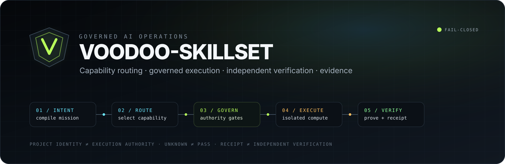

<p align="center">
  
</p>

<p align="center">
  <a href="https://github.com/eimyroot/VOODOO-SKILLSET/actions/workflows/ci.yml"></a>
  
  
  
</p>

# VOODOO-SKILLSET

**Governed orchestration control plane for AI capabilities.** It selects and composes skills, agents, subagents, plugins and tools into a bounded execution DAG, applies authority gates before execution, and records independently verifiable evidence instead of treating an execution receipt as proof.

> **Core rule:** project identity is not execution authority. Unknown, missing and unverified states never become PASS by implication.

## Why it exists

Agent systems become dangerous when discovery, planning, execution and verification collapse into one authority domain. VOODOO-SKILLSET separates them.

```text
MISSION
  │
  ▼
Intent Compiler
  │
  ▼
Capability Router ── bounded learning signal
  │
  ▼
Dynamic DAG Composer
  │
  ▼
Authority Gate ───── fail closed
  │
  ├── BLOCK / APPROVAL REQUIRED
  │
  ▼
Governed Execution ─ CASTER-MINAL worker fleet
  │
  ▼
Signed Receipt ───── UNKNOWN until independently verified
  │
  ▼
Independent Verifier
  │
  ▼
Hash-chained Evidence
```

## Implemented

- Intent Compiler and capability routing
- Dynamic governed DAG composition
- Skill / agent / subagent / plugin / tool runtime contracts
- CASER source-of-truth boundaries
- CASTER-MINAL-compatible governed terminal integration
- Signed `executor-v1` remote execution protocol
- Persistent replay protection and signed receipts
- Workspace-scoped COMPUTE with deny-by-default networking
- Linux namespace or digest-pinned Docker/runc isolation
- Durable R3 executor fleet with atomic leases, TTL, heartbeat and retries
- Separate worker and verifier identities
- SQLite durable reference backend
- Supabase/Postgres multi-instance contract
- Hash-chained fleet events and Evidence Ledger
- Independent plan verifier and fleet verifier workers
- Red-team orchestration mode
- Zero-dependency REST API
- Responsive browser Control Room / cockpit
- CLI and operator entrypoints
- Python 3.12 / 3.13 CI
- Real Linux Docker/runc executor and multi-worker fleet E2E gates

## Run the cockpit

The cockpit uses the repository's zero-dependency Python HTTP server and the real control-plane API. No frontend build step is required.

```bash
git clone https://github.com/eimyroot/VOODOO-SKILLSET.git
cd VOODOO-SKILLSET
make cockpit
```

Open **http://127.0.0.1:8787**.

Equivalent direct command:

```bash
PYTHONPATH=src python3 -m voodoo_skillset.cli serve --host 127.0.0.1 --port 8787
```

Verify the full repository contract:

```bash
make verify
```

The Vercel configuration routes `/` to the same Control Room and `/api/*` to the server-side Python API. Production mutation remains blocked until production identity, durable database and executor infrastructure are explicitly configured.

## Example governed plan

```bash
PYTHONPATH=src python3 -m voodoo_skillset.cli plan \
  "Audit the GitHub repository, review security, implement fixes, test and verify" \
  --mode ALL \
  --connector github \
  --tool filesystem-write \
  --tool test-runner \
  --tool isolated-runner \
  --tool web-search
```

## Trust invariants

```text
PROJECT IDENTITY != EXECUTION AUTHORITY
EXECUTOR IDENTITY != VERIFIER IDENTITY
UNKNOWN    != PASS
MISSING    != PASS
UNVERIFIED != PASS
ExecutionReceipt != IndependentVerification
ExclusiveLease != ExactlyOnce
```

The executor accepts **COMPUTE only**. `WRITE`, `REMOTE_WRITE`, `DEPLOY`, `DESTRUCTIVE` and `PRIVILEGED` requests fail closed unless a different governed boundary explicitly authorizes them.

## Runtime architecture

```text
Operator / Browser
       │
       ▼
VOODOO Control Plane
       │
       ├──── durable VERIFIED_PLAN / queue / evidence ────┐
       │                                                   │
       │ WORKER bearer                                     │ VERIFIER bearer
       ▼                                                   ▼
CASTER-MINAL workers 1..N                         independent verifier workers
       │
       │ signed executor-v1
       ▼
safe backend probe
   │                 │
   ▼                 ▼
Linux namespaces   Docker/runc container
                  digest-pinned image
       │
       ▼
signed receipt: UNKNOWN
       │
       └────────────────────> durable coordinator ────────> VERIFIED / FAILED / BLOCKED
```

### Isolation contract

`VOODOO_EXECUTOR_BACKEND=auto` prefers the kernel namespace/chroot backend when its real capability probe succeeds. If user namespaces are blocked, it can use the container backend only when an immutable digest-pinned image has already been provisioned. There is **no unisolated fallback**.

The Docker/runc sandbox uses `--pull=never`, `--network=none`, a read-only root filesystem, all Linux capabilities dropped, `no-new-privileges`, bounded PID/CPU/memory/file-size/fd/output limits and only an ephemeral CASER workspace copy. The Docker socket and executor/control-plane secrets are not mounted into child workloads.

## Durable fleet authority domains

```text
CONTROL token   -> enqueue jobs for durable VERIFIED_PLAN only
WORKER token    -> claim / heartbeat / receipt / failure only
VERIFIER token  -> verification claim / verdict only
DB service role -> Control Plane only
```

Workers and verifiers use the HTTP coordinator API and never receive the Supabase service-role key. A worker cannot verify a job it executed.

The queue uses exclusive active leases with TTL and retry. This prevents legitimate concurrent double ownership, but retries make delivery at-least-once capable; VOODOO therefore does **not** label the model exactly-once.

### Durable backends

Single persistent coordinator:

```bash
VOODOO_FLEET_DB=/srv/voodoo/fleet.sqlite3
```

Multi-instance Supabase/Postgres control plane:

```text
VOODOO_FLEET_SUPABASE_URL
VOODOO_FLEET_SUPABASE_SERVICE_ROLE_KEY
VOODOO_CONTROL_API_TOKEN
VOODOO_FLEET_WORKER_TOKEN
VOODOO_FLEET_VERIFIER_TOKEN
VOODOO_EXECUTOR_SHARED_SECRET
```

The Postgres contract uses `FOR UPDATE SKIP LOCKED`, RLS, deny-by-default client roles, hashed lease tokens and append-only hash-chain events.

## Executor node

```bash
VOODOO_EXECUTOR_SHARED_SECRET='...' \
VOODOO_EXECUTOR_BACKEND=auto \
VOODOO_EXECUTOR_CONTAINER_IMAGE='name@sha256:<digest>' \
voodoo-executor \
  --workspace-root /srv/voodoo/workspaces \
  --host 127.0.0.1 \
  --port 8790
```

Fleet worker:

```bash
VOODOO_FLEET_WORKER_TOKEN='...' \
VOODOO_EXECUTOR_SHARED_SECRET='...' \
VOODOO_EXECUTOR_BACKEND=container \
VOODOO_EXECUTOR_CONTAINER_IMAGE='name@sha256:<digest>' \
voodoo-fleet-worker \
  --coordinator-url https://control.example.com \
  --workspace-root /srv/voodoo/workspaces \
  --worker-id executor-01 \
  --drain
```

Independent verifier:

```bash
VOODOO_FLEET_VERIFIER_TOKEN='...' \
voodoo-fleet-verifier \
  --coordinator-url https://control.example.com \
  --workspace-root /srv/voodoo/workspaces \
  --verifier-id verifier-01 \
  --drain
```

> Docker daemon access is host-level authority. Conventional Docker daemon access belongs only on a dedicated CASTER-MINAL executor host; rootless or daemonless isolation is preferred where operationally available.

## Repository map

```text
api/                 Vercel server-side API adapter
src/voodoo_skillset/ control plane, policy, fleet, execution and verification
web/                 zero-build browser cockpit
tests/               unit, contract and runtime tests
registry/            capability registry
schemas/             machine-readable contracts
integrations/        integration contracts
infra/               production infrastructure definitions
deploy/              executor deployment examples
tools/               verification and operator tooling
docs/                architecture, operations and security documentation
evidence/            local/runtime evidence boundary
```

See [`docs/REPOSITORY_HYGIENE.md`](docs/REPOSITORY_HYGIENE.md) for the scaffold audit and [`docs/ARCHITECTURE.md`](docs/ARCHITECTURE.md) for the architectural boundary map.

## Documentation

- [`docs/ARCHITECTURE.md`](docs/ARCHITECTURE.md) — system boundaries and data flow
- [`docs/EXECUTOR_R1.md`](docs/EXECUTOR_R1.md) — signed remote protocol
- [`docs/EXECUTOR_R2.md`](docs/EXECUTOR_R2.md) — isolated executor node
- [`docs/EXECUTOR_R3.md`](docs/EXECUTOR_R3.md) — durable executor fleet
- [`docs/DEPLOYMENT.md`](docs/DEPLOYMENT.md) — deployment model
- [`docs/SECURITY.md`](docs/SECURITY.md) — security model
- [`CONTRIBUTING.md`](CONTRIBUTING.md) — repository workflow
- [`SECURITY.md`](SECURITY.md) — vulnerability reporting

## Reality boundary

The repository contains a real multi-worker fleet implementation and a deployable Supabase/Postgres contract. CI proves the Postgres lease/RLS/event-chain behavior and real Docker/runc execution paths on GitHub-hosted Linux runners.

GitHub-hosted runners are **verification infrastructure**, not a persistent production fleet. A dedicated production Supabase project, persistent/on-demand Linux executor capacity, durable workspace/artifact transport and browser-to-production authorization are separate infrastructure decisions and are not silently implied by this repository.

The browser cockpit exposes runtime truth but no execution/database secrets. Production execution must remain blocked until durable identity/session authorization and production fleet/database infrastructure are configured and independently verified.
